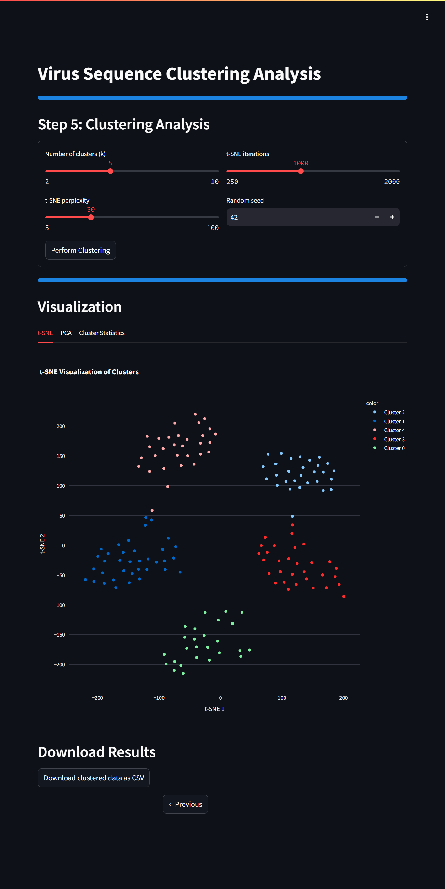

# Virus Sequence Clustering Analysis



## Project Overview

The Virus Sequence Clustering Analysis project is an interactive web application that performs advanced clustering analysis on virus sequence data. Using sophisticated machine learning techniques including K-means clustering, Principal Component Analysis (PCA), and t-SNE (t-Distributed Stochastic Neighbor Embedding), it provides comprehensive analysis and visualization of virus sequence patterns.

While the example notebook demonstrates analysis using the [SARS Coronavirus Dataset](https://www.kaggle.com/datasets/jamzing/sars-coronavirus-accession), the application is designed to work with any CSV file containing numerical or categorical data suitable for clustering analysis.

### Analysis Techniques

The system employs multiple analytical methods to provide comprehensive insights:

1. **K-means Clustering**
   - Unsupervised learning for pattern discovery
   - Optimal cluster number determination via elbow method
   - Centroid-based clustering for pattern identification

2. **Principal Component Analysis (PCA)**
   - Dimensionality reduction while preserving variance
   - Feature importance analysis
   - Data visualization in 2D space

3. **t-SNE Visualization**
   - Non-linear dimensionality reduction
   - Complex pattern preservation
   - Interactive visualization of high-dimensional data

### Feature Analysis

Key components of the analysis pipeline:

1. **Data Preprocessing**
   - Categorical variable encoding
   - Feature scaling options
   - Missing value handling

2. **Interactive Analysis**
   - Real-time clustering visualization
   - Dynamic parameter adjustment
   - Multiple visualization methods

3. **Results Export**
   - Clustered data download
   - Visual result export
   - Analysis summary

## Table of Contents

1. [Dataset](#dataset)
2. [Features](#features)
3. [Streamlit Application](#streamlit-application)
4. [Deployment Options](#deployment-options)
5. [File Structure](#file-structure)
6. [Usage](#usage)
7. [License](#license)

## Dataset

The example notebook uses SARS Coronavirus sequence data from Kaggle:
- Dataset: [SARS Coronavirus Dataset](https://www.kaggle.com/datasets/jamzing/sars-coronavirus-accession)
- Format: CSV file
- Features: Sequence alignments, identity percentages, and related metrics

Note: The application can analyze any CSV file with appropriate numerical or categorical data.

## Features

- Intuitive step-by-step analysis workflow
- Multiple preprocessing options:
  - Feature selection
  - Column renaming
  - Categorical encoding
  - Data scaling
- Advanced visualization techniques:
  - Interactive t-SNE plots
  - PCA visualization
  - Cluster distribution analysis
- Comprehensive results:
  - Cluster statistics
  - Downloadable results
  - Visual analysis exports

## Streamlit Application

The application (`app/app.py`) provides:
- Step-by-step analysis workflow
- Interactive parameter selection
- Real-time visualization
- Multiple preprocessing options
- Results download functionality

## Deployment Options

### 1. Local Deployment
```bash
git clone https://github.com/pouryare/clustering-virus.git
cd clustering-virus/app
python -m venv venv
source venv/bin/activate  # On Windows use `venv\Scripts\activate`
pip install -r requirements.txt
streamlit run app.py
```
Access at `http://localhost:8501`

### 2. Docker Deployment
Two options:

a) Pull and run the pre-built image:
```bash
docker pull pouryare/cluster:latest
docker run -p 8501:8501 pouryare/cluster:latest
```

b) Build and run locally:
```bash
cd app
docker build -t cluster:latest .
docker run -p 8501:8501 cluster:latest
```

### 3. Heroku Deployment
```bash
heroku login
heroku create clustering-virus
heroku buildpacks:add --index 1 heroku/python
heroku buildpacks:add --index 2 https://github.com/heroku/heroku-buildpack-apt
git push heroku main
```

### 4. AWS EC2 Deployment
1. Connect to EC2:
```bash
ssh -i your-key.pem ec2-user@your-instance-ip
```

2. Install dependencies:
```bash
sudo yum update -y
sudo yum install git python3 python3-pip -y
```

3. Setup application:
```bash
git clone https://github.com/pouryare/clustering-virus.git
cd clustering-virus/app
pip3 install -r requirements.txt
streamlit run app.py
```

### 5. Google Cloud Platform Deployment
```bash
gcloud init
gcloud app create
gcloud app deploy
gcloud app browse
```

### 6. Microsoft Azure Deployment
```bash
az webapp create --resource-group myResourceGroup \
                 --plan myAppServicePlan \
                 --name clustering-virus \
                 --runtime "PYTHON|3.8"

az webapp deployment source config \
    --name clustering-virus \
    --resource-group myResourceGroup \
    --repo-url https://github.com/pouryare/clustering-virus.git \
    --branch main \
    --manual-integration
```

## File Structure
```
clustering-virus/
├── app/
│   ├── app.py
│   ├── app.yaml
│   ├── Dockerfile
│   ├── Procfile
│   ├── requirements.txt
│   ├── setup.py
│   └── setup.sh
├── Clustering_virus.ipynb
├── README.md
└── screenshot.png
```

## Usage

1. Access the application through your preferred deployment method
2. Upload a CSV file containing data for clustering
3. Follow the step-by-step workflow:
   - Select and preprocess features
   - Configure clustering parameters
   - Analyze results through multiple visualizations
4. Download results and visualizations

## License

This project is licensed under the MIT License. See the [MIT License](https://opensource.org/licenses/MIT) page for details.

---

For issues or suggestions, please open an issue on the [GitHub repository](https://github.com/pouryare/clustering-virus).

This project demonstrates the power of unsupervised learning and dimensionality reduction techniques in analyzing complex biological data. Through interactive visualization and comprehensive analysis tools, it offers insights into patterns within virus sequence data and other numerical datasets. Whether you're a researcher, bioinformatician, or data scientist, this tool provides practical insights through advanced clustering analysis.